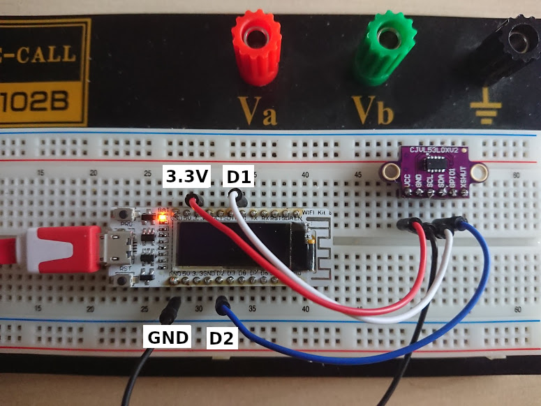

# ESP8266

My playground to do funny things on one of my microprocessors.

It has an OLED included; attached as i2c. 

The first small "apps" are:
* graphic_test
* i2cscan
* distance (attached an VL53L0XV2)

## graphic_test
* pure taken from examples of u8g2

## i2cscan
* taken from examples.

## distance
* Taken from examples of VL53L0X with some minor modifications.
* SCL is connected to "D1"
* SDA is connected to "D2"
* using this configuration adds the sensor to the "default" i2c-environment. With this Wire.begin() needs no further arguments. 
* Measured distance is printed to serial. 
* Following picture shows the wireing. 
